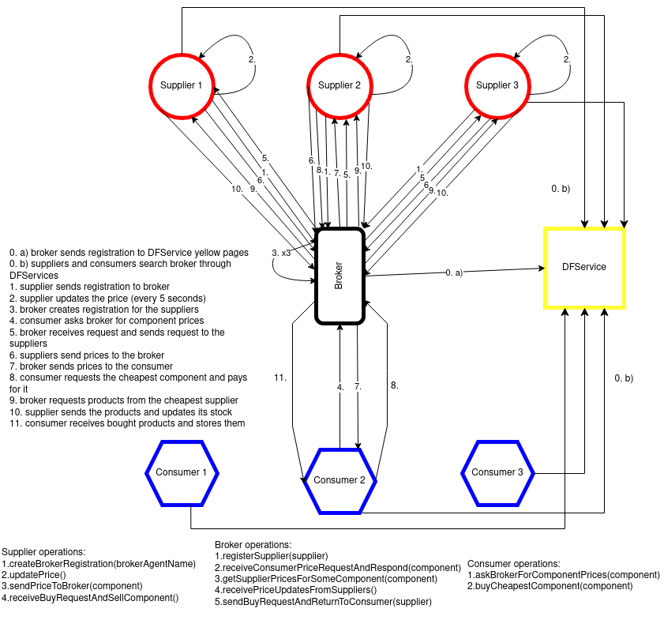

# Ultraoriginal Car Components Market Simulation
A simple market simulation written in Java using the JADE agent development framework.

## Simulation description

Every 5 seconds, each supplier generates random prices around a given reference price for the available items, with a small variation of maximum 20%. At every 5 seconds, the consumers can request the available prices from the broker (which should return the prices for the required component from the suppliers back to the consumer) and then they will decide to buy the cheapest available product from the consumer that offers it. The broker is an intermediary agent that handles the trades established between suppliers and consumers.

Bonus: There will be multiple brokers who will apply a small random tax for the communication service that they offer and suppliers will have to pay the broker or end the deal and register to a new broker with the cheapest services available.

## Diagram

